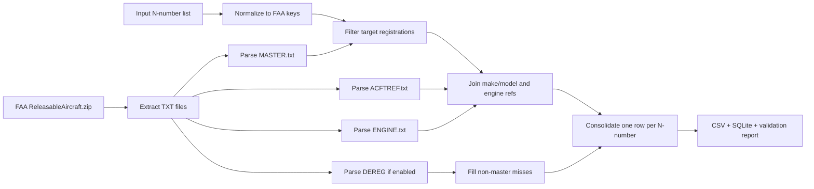

# FAA Releasable Aircraft Data Pipeline

## Purpose

Build one normalized aircraft-registry record per target N-number from the FAA Releasable Aircraft Database.

## Source authority

- FAA bulk ZIP: `https://registry.faa.gov/database/ReleasableAircraft.zip`
- FAA file layout PDF: `https://registry.faa.gov/database/ardata.pdf`

The pipeline treats the FAA bulk download as authoritative for registry fields. The FAA documentation states that the bulk archive contains the Aircraft Registration Master file, dealer file, document index, aircraft reference, deregistered aircraft, engine reference, and reserve N-number files. It also states that the data is refreshed daily and delivered as comma-delimited text.

## Repo placement

Recommended spiderweb-pr placement:

```text
scripts/faa_registry_pipeline.py
docs/FAA_REGISTRY_PIPELINE.md
tests/test_faa_registry_pipeline.py
tests/fixtures/faa_registry_sample/
input/regs.txt
data/faa_registry/              # gitignored raw FAA ZIP/TXT
outputs/faa_registry/           # generated CSV/SQLite/report
```

## Run

```bash
python scripts/faa_registry_pipeline.py --registrations input/regs.txt --download --faa-dir data/faa_registry --faa-zip data/faa_registry/ReleasableAircraft.zip --output-dir outputs/faa_registry
```

## Outputs

```text
outputs/faa_registry/faa_registry_consolidated.csv
outputs/faa_registry/faa_registry.db
outputs/faa_registry/faa_registry_validation_report.md
outputs/faa_registry/faa_registry_missingness.csv
outputs/faa_registry/faa_registry_summary.json
outputs/faa_registry/faa_registry_etl_diagrams.md
```

## Validation gates

The pipeline should fail or block promotion when:

| Gate | Blocking condition |
|---|---|
| Input list | No valid N-numbers parsed |
| FAA source | MASTER file not located |
| Coverage | Matched + deregistered + missing != target count |
| Cardinality | Output rows != unique target registrations |
| Conflict ledger | Conflict groups exist but no conflict notes are written |
| Source lineage | ZIP/TXT hashes missing from summary JSON |

## Integration notes

1. FAA master N-number values may be stored without the leading `N`; the script normalizes both sides to the internal FAA key.
2. Do not assume `MASTER.txt` has headers. The script assigns fieldnames using the FAA layout.
3. Missing permissible fields are not errors. Treat them as blank values and summarize missingness separately.
4. Use the FAA N-number web inquiry for spot checks or manual adjudication, not as the primary extraction source.
5. Do not commit the raw 60 MB ZIP unless the repo policy explicitly allows it. Commit the script, tests, docs, and small fixtures; keep raw source files in `data/faa_registry/`.

## Mermaid ETL


